# Six Making

## Group Identification

Group T10_Six Making_4

Catarina Isabel Moreira Canelas - 202103628

## Installation and Execution

First, to be able to execute this game, it is required to have SICStus Prolog 4.8 installed and the folder with the source code (src).

Next, consult the file main.pl located in the folder src, like this:

?- consult('./menu.pl').

While using Windows, it is also possible to consult this file by selection the option File and next the option Consult..., and then choose the file main.pl.

Lastly, to run the program and enter the main menu of the game, execute the next command (predicate play/0):

?- play.

## Description of the game

This game is played in a board 5x5 with two players. Each player has a color, red (r) or blue (b). To distinguish the two playes, the pieces of player r are shown with the first letter of its name (P, R, L, B, Q, K) and the pieces of player b are shown with the number representing its stack lenght (1, 2, 3, 4, 5, 6).

This game consists in moving pieces to make a stack of 6 pieces and win the game. There are 6 types of stacks, each piece with its own movement, depending on its height. A Pawn has 1 piece, a Rook has 2 pieces stacked, a Knight has 3 pieces stacked, a Bishop has 4 pieces stacked, a Queen has 5 pieces stacked and a King has 6 pieces stacked. The movement rules are similar to Chess rules. The goal is to make a King, with your color on the top.

Movement rules:
- **Pawn** -> can only move 1 space horizontal or vertical
- **Rook** -> can move any number of spaces horizontal or vertical
- **Knight** -> moves in "L" shape: 1 step orthogonal (horizontal or vertical) and then 1 step diagonal
- **Bishop** -> can move any number of spaces diagonally
- **Queen** -> moves any number of spaces in any direction
- **King** -> has no moves. Wins the game.

Some additional rules are:
- A piece may only be inserted on an empty cell;
- A piece may only be stacked on top of another piece;

We used two sites to gather some information about this game:
- [Official Game Website](https://www.boardspace.net/english/about_sixmaking.html)
- [Rule Book](https://boardspace.net/sixmaking/english/Six-MaKING-rules-Eng-Ger-Fra-Ro-Hu.pdf)

## Game Logic

### Internal Game State Representation

The game state is represented by the current state of the board and the color of the current player.

The color that represents a player (r or b) is randomly choosen.

The board is a list of lists, with each list being a row of the board. Each element of each row is also a list (stack) with the top of the stack being the color that represents the player (r or b) and the rest being the stack of pieces the players have done while playing. 
For example, if the list is empty and has no pieces, it will be represented like this []. If the player red has 1 piece it is represented like this [r]. If the player red has 1 piece, the player blue has also 1 piece, and the player red places its piece on top of the blue player piece, their lists will be like this: red player list -> [r, b] and blue player list -> []. This means now red player has made a Rook (a stack with size 2).

#### Initial Game State

```
[
[ [], [], [], [], [] ],
[ [], [], [], [], [] ],
[ [], [], [], [], [] ],
[ [], [], [], [], [] ],
[ [], [], [], [], [] ]
]
```

This image is the initial game state on SICStus:

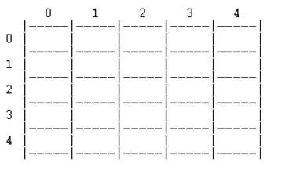

#### Intermediate Game State

```
[
[ [r],    [b], [b, b],       [],     [] ],
[ [b, r], [],  [r, r, b],    [],     [] ],
[ [],     [r], [b, r, b, r], [],     [] ],
[ [],     [],  [],           [r, b], [] ],
[ [],     [],  [],           [],     [] ]
]
```

This image is the intermediate game state on SICStus, with some movements made:

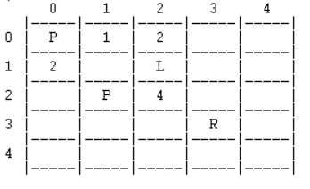

#### Final Game State


```
[
[ [r],    [b], [b, b],             [],        [] ],
[ [b, r], [],  [b],                [],        [] ],
[ [],     [],  [r, r, b, r, b, r], [],        [] ],
[ [],     [],  [],                 [r, r, b], [] ],
[ [],     [],  [],                 [],        [] ]
]
```

This image is the final game state on SICStus, with player red being the winner (made a King, a stack with length 6):

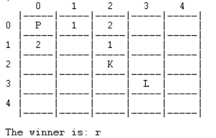

### Game State Visualization

The game state display predicate is divided into two different functions. One of them represents the menu (main_menu) and the other representing the game state display and its interactions (display_game).

The menu predicates are main_menu/0 and in case of choosing bot optins, there is also a predicate choose_bot_dif/2 where the user is able to choose the difficulty of the computer.
The main menu is displayed like this:
 
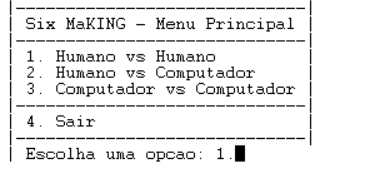

The menu to choose the computer difficulty is displayed like the next image:

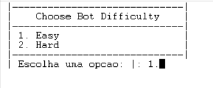

The predicate representing the game state display and its interactions is display_game/1. This predicate receives the current state of the game and the player who will make the next move, displaying both of them. display_game/1 also uses another predicate, which is display_board/2, that will create the board game. This predicate is in other predicates, like insert_piece/8 where the insertion of a new piece is made, and move_piece_logic/8 where the movement of a piece is processed. These two predicates are also used in two other predicated that are process_choose_move/4 and place_piece/3, where user interaction will be used. The predicate process_choose_move/4 deals with the user choosing the movement of a piece and the predicate place_piece/3 deals with the user choosing the cell of a new piece. All the user interaction is validated and when a error is made it is displayed messages to inform the user and ask for a new input.

The next image shows how a user can choose between inserting a new piece or moving a piece:

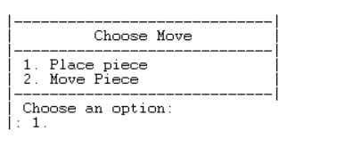

When choosing to insert a new piece, the user interaction is validated as shown in the next images:

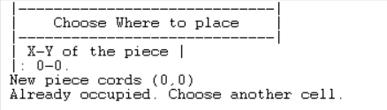
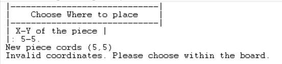

When choosing to move a piece, the user interaction is validated as shown in the next images:

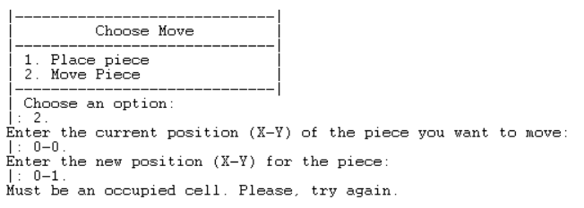
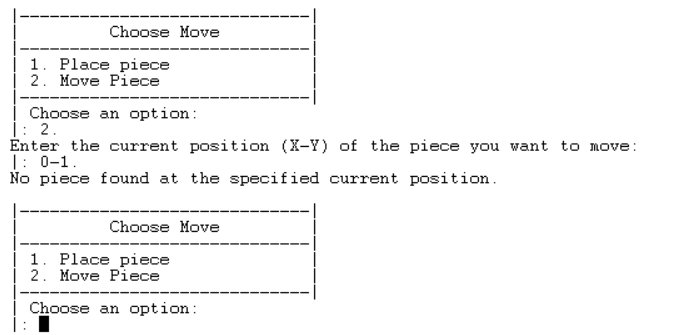

The predicate game_state/1 is displayed like this:

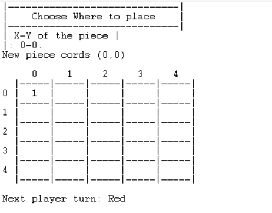

### Move Validation and Execution

The predicate to validate and execute a play, obtaining a new game state, is called process_choose_move/4.

```
process_choose_move(Option, Board, Color, Counters)
```
It validates the user input and displays error messages if the input is not valid. 
In this game, there are two type of moves: insert a new piece and move a piece.

To insert a new piece we have the predicate place_piece/3. In this predicate, the user is asked to insert the coordinates of the new piece, and those coordinates are validated. Then, it also has the predicate insert_piece/8 where the piece will be inserted in the board. The predicate place_piece/3 also checks when a player has inserted all its given pieces (8).

How the user is asked to insert a new piece:

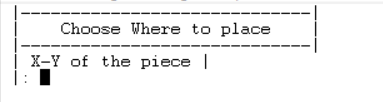

How the user input is validated:


When a user has used all its 8 pieces, this message is shown:

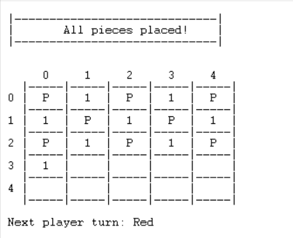

To move a piece, we have the predicate move_piece/3. In this predicate, the user is asked the coordinates of the piece he wants to move and the new coordinates that that piece will have. All of those coordinates are validated. Then, it also has the predicate move_piece_logic/8 where the piece will be moved.

How the user is asked the current coordinates of the piece to be moved, and the new coordinates.

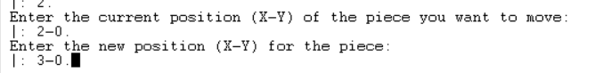

How the user input is validated:

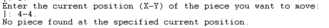
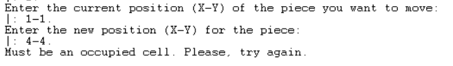

When a movement is made and a piece is moved, it will create a new length of the stack of pieces. Each size of the stack represents a different movement rule, as explained in section **Description of the game**. Those movement rules are also validated, as the next images will show.

Validation of Pawn move:

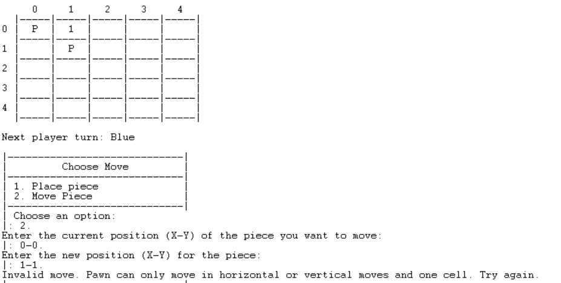

Validation of Rook move:

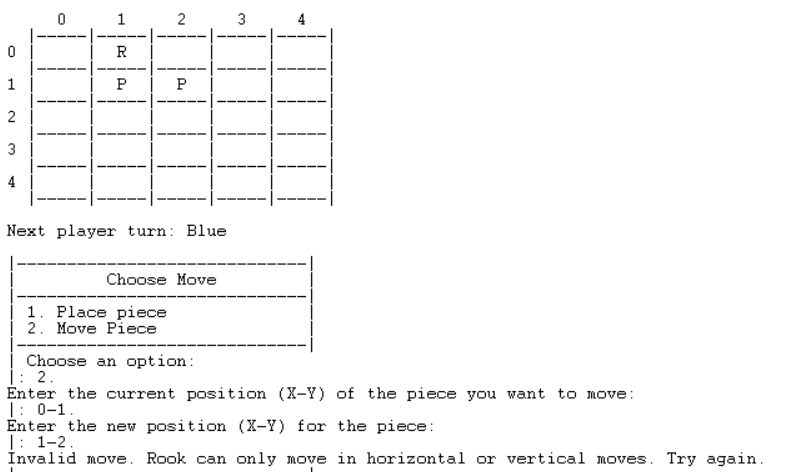

Validation of Knight move:

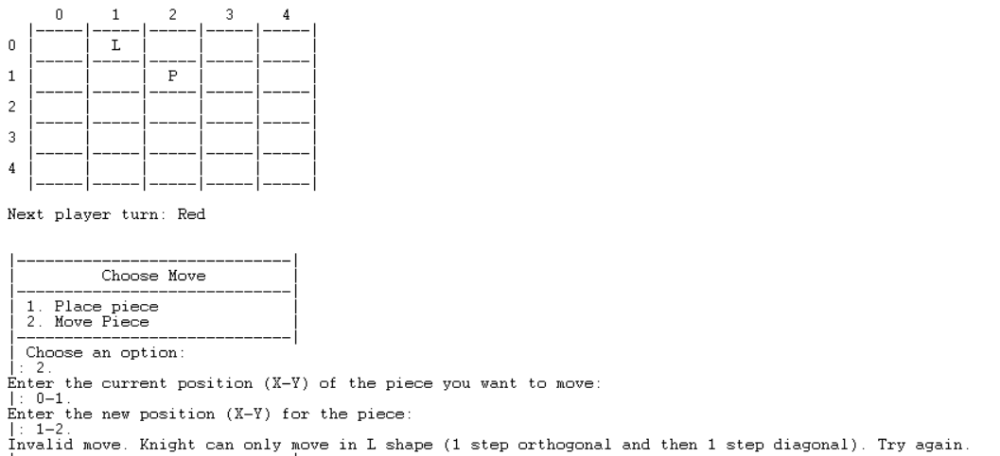

Validation of Bishop move:

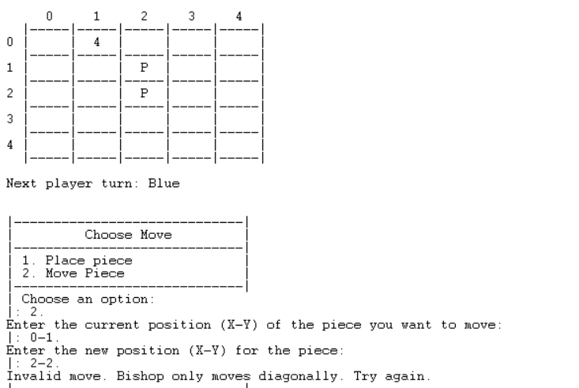

Validation of Queen move: Queen has no validation as it can move number of spaces in any direction. All moves are valid.

Validation of King move: King has no validation as it means the player has win the game.


### List of Valid Moves

### End of Game

The predicate that checks if the game has ended is the predicate game_over/2.

```
game_over(Board, Winner)
```

This predicate determines the winner player and its true if the game has ended.
It will transverse all the rows of the board, and then all the stacks of the rows, and checks if any of those stacks is length six. If there are one stack with length six, then the game ends and the player winner is displayed.

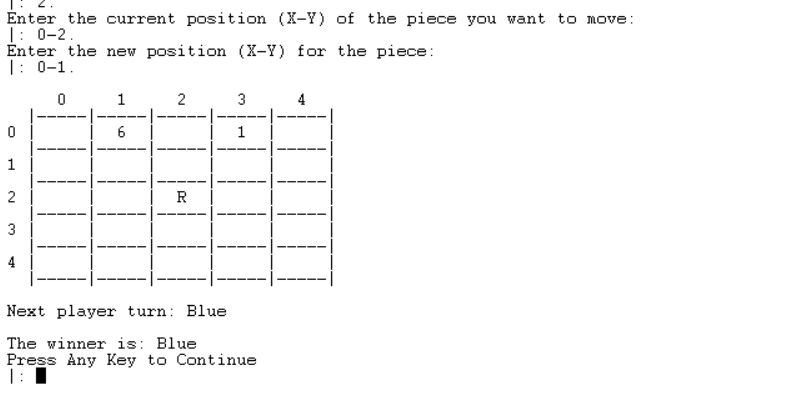

### Game State Evaluation

### Computer Plays
Antes de começar o jogo é perguntado a dificuldade do bot e caso o bot fácil seja selecionado o bot vai escolher entre entre colocar ou mover uma peça sendo a probabilidade de mover ser escolhido 20%. Caso seja escolhido colocar é verificado se o bot tem peças para colocar atraves do predicado hasPiecesLeft/2 e vai ser gerado um par X-Y aleatoriamente através do predicado random_XY_generator/2. Em seguida é chamado o predicado run_bot/8, que coloca a peça nas cordenadas geradas e caso as cordenadas geradas sejam de uma peça já existente gera umas novas cordenadas através do predicado new_XY_run_bot/8. Caso seja escolhido mover uma peça o bot gera um par X-Y através do predicado random_XY_generator/2, verifica se a peça existe no tabuleiro através do predicado check_piece/3 e caso a peça exista gera outro par X-Y, agora para onde o bot irá mover a peça, e verifica novamente se existe essa peça no tabuleiro. Assegura-se que existe um movimento válido, pelo predicado validate_move_bot/5, e move a peça para essa nova posição.


## Conclusions

This project was implement in a new language that was not familiar to us, which made this game a new challenge. However, this board game
was successfully implemented and works as expected.

The main difficulty of this project was finding a way to represent easily the stacks with different sizes. We found a way to do this by using
lists and keeping the top of the stack at the beginning of the list.

## Bibliography

https://www.boardspace.net/english/about_sixmaking.html

https://boardspace.net/sixmaking/english/Six-MaKING-rules-Eng-Ger-Fra-Ro-Hu.pdf

